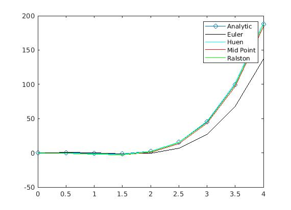

# matlab-ode-solvers
A MATLAB implementation of Ordinary Differential Equation solving algorithms(Euler, Huen, Ralston, Mid Point)  
## ODE
In mathematics, an [**ordinary differential equation**](https://en.wikipedia.org/wiki/Ordinary_differential_equation) (ODE) is a differential equation containing one or more functions of one independent variable and the derivatives of those functions. The term ordinary is used in contrast with the term partial differential equation which may be with respect to more than one independent variable
## ODE Solving Algorithms
[**Numerical methods** for ordinary differential equations](https://en.wikipedia.org/wiki/Numerical_methods_for_ordinary_differential_equations) are methods used to find numerical approximations to the solutions of **ordinary differential equations** (ODEs). Their use is also known as **"numerical integration"**, although this term can also refer to the computation of integrals.

Many differential equations cannot be solved using symbolic computation ("**analysis**"). For practical purposes, however – such as in engineering – a numeric approximation to the solution is often sufficient. The algorithms studied here can be used to compute such an approximation. An alternative method is to use techniques from calculus to obtain a series expansion of the solution.

### Euler Method
In mathematics and computational science, the [**Euler method**](https://en.wikipedia.org/wiki/Euler_method) (also called forward Euler method) is a first-order numerical procedure for solving ordinary differential equations (ODEs) with a given initial value. It is the most basic explicit method for numerical integration of ordinary differential equations and is the simplest Runge–Kutta method. 
### Huen Method
In mathematics and computational science, [**Heun's method**](https://en.wikipedia.org/wiki/Heun%27s_method) may refer to the improved or modified Euler's method (that is, the explicit trapezoidal rule), or a similar two-stage Runge–Kutta method. It is named after Karl Heun and is a numerical procedure for solving ordinary differential equations (ODEs) with a given initial value. Both variants can be seen as extensions of the Euler method into two-stage second-order Runge–Kutta methods.
### Ralston Method
[Ralston's second order method](http://www.mymathlib.com/diffeq/runge-kutta/runge_kutta_ralston_2.html) is a Runge-Kutta method for approximating the solution of the initial value problem which evaluates the integrand twice for each step. Ralston's second order method is a second order procedure for which Richardson extrapolation can be used.
### Midpoint Method
The m[idpoint method](https://www.efunda.com/math/num_ode/num_ode.cfm#:~:text=The%20midpoint%20method%2C%20also%20known,the%20accuracy%20by%20one%20order.), also known as the second-order Runga-Kutta method, improves the Euler method by adding a midpoint in the step which increases the accuracy by one order.

### Comparison of Algorithms

